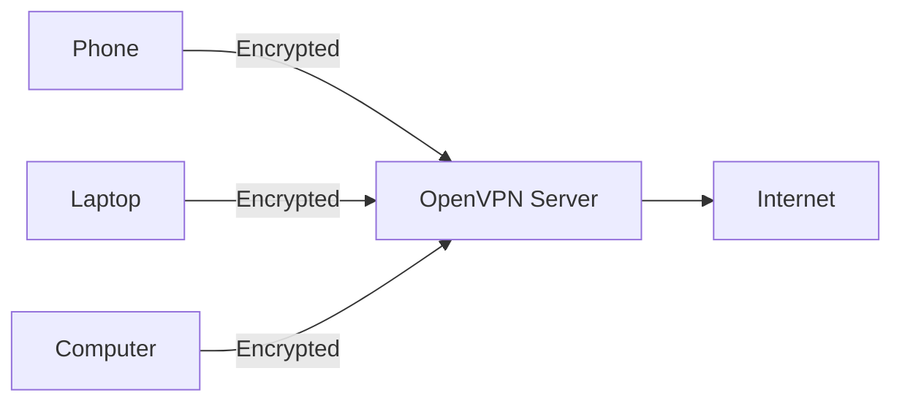

# openvpn-install

[](https://saythanks.io/to/angristan)

OpenVPN installer for Debian, Ubuntu, Fedora, openSUSE, CentOS, Amazon Linux, Arch Linux, Oracle Linux, Rocky Linux and AlmaLinux.

This script will let you setup and manage your own secure VPN server in just a few seconds.

## What is this?

This script is meant to be run on your own server, whether it's a VPS or a dedicated server, or even a computer at home.

Once set up, you will be able to generate client configuration files for every device you want to connect.

Each client will be able to route its internet traffic through the server, fully encrypted.



## Why OpenVPN?

OpenVPN was the de facto standard for open-source VPNs when this script was created. WireGuard came later and is simpler and faster for most use cases. Check out [wireguard-install](https://github.com/angristan/wireguard-install).

That said, OpenVPN still makes sense when you need:

- **TCP support**: works in restrictive environments where UDP is blocked (corporate networks, airports, hotels, etc.)
- **Password-protected private keys**: WireGuard configs store the private key in plain text
- **Legacy compatibility**: clients exist for pretty much every platform, including older systems

## Features

- Installs and configures a ready-to-use OpenVPN server
- CLI interface for automation and scripting (non-interactive mode with JSON output)
- Certificate renewal for both client and server certificates
- List and monitor connected clients
- Uses [official OpenVPN repositories](https://community.openvpn.net/openvpn/wiki/OpenvpnSoftwareRepos) when possible for the latest stable releases
- Firewall rules and forwarding managed seamlessly (native firewalld and nftables support, iptables fallback)
- Configurable VPN subnet (default: `10.8.0.0/24`)
- If needed, the script can cleanly remove OpenVPN, including configuration and firewall rules
- Customisable encryption settings, enhanced default settings (see [Security and Encryption](#security-and-encryption) below)
- Uses latest OpenVPN features when available (see [Security and Encryption](#security-and-encryption) below)
- Variety of DNS resolvers to be pushed to the clients
- Choice to use a self-hosted resolver with Unbound (supports already existing Unbound installations)
- Choice between TCP and UDP
- NATed IPv6 support
- Compression disabled by default to prevent VORACLE. LZ4 (v1/v2) and LZ0 algorithms available otherwise.
- Unprivileged mode: run as `nobody`/`nogroup`
- Block DNS leaks on Windows 10
- Randomised server certificate name
- Choice to protect clients with a password (private key encryption)
- Option to allow multiple devices to use the same client profile simultaneously (disables persistent IP addresses)
- Many other little things!

## Compatibility

The script supports these Linux distributions:

|                     | Support |
| ------------------- | ------- |
| AlmaLinux >= 8      | ✅ 🤖   |
| Amazon Linux 2023   | ✅ 🤖   |
| Arch Linux          | ✅ 🤖   |
| CentOS Stream >= 8  | ✅ 🤖   |
| Debian >= 11        | ✅ 🤖   |
| Fedora >= 40        | ✅ 🤖   |
| openSUSE Leap >= 16 | ✅ 🤖   |
| openSUSE Tumbleweed | ✅ 🤖   |
| Oracle Linux >= 8   | ✅ 🤖   |
| Rocky Linux >= 8    | ✅ 🤖   |
| Ubuntu >= 18.04     | ✅ 🤖   |

To be noted:

- The script is regularly tested against the distributions marked with a 🤖 only.
  - It's only tested on `amd64` architecture.
- The script requires `systemd`.

## Usage

First, download the script on your server and make it executable:

```bash
curl -O https://raw.githubusercontent.com/angristan/openvpn-install/master/openvpn-install.sh
chmod +x openvpn-install.sh
```

You need to run the script as root and have the TUN module enabled.

### Interactive Mode

The easiest way to get started is the interactive menu:

```bash
./openvpn-install.sh interactive
```

This will guide you through installation and client management.

In your home directory, you will have `.ovpn` files. These are the client configuration files. Download them from your server (using `scp` for example) and connect using your favorite OpenVPN client.

If you have any question, head to the [FAQ](#faq) first. And if you need help, you can open a [discussion](https://github.com/angristan/openvpn-install/discussions). Please search existing issues and discussions first.

### CLI Mode

> [!WARNING]
> API compatibility is not guaranteed. Breaking changes may occur between versions. If you use this script programmatically (e.g., in automation or CI/CD), pin to a specific commit rather than using the master branch.

For automation and scripting, use the CLI interface:

```bash
# Install with defaults
./openvpn-install.sh install

# Add a client
./openvpn-install.sh client add alice

# List clients
./openvpn-install.sh client list

# Revoke a client
./openvpn-install.sh client revoke alice
```

#### Commands

```text
openvpn-install <command> [options]

Commands:
  install       Install and configure OpenVPN server
  uninstall     Remove OpenVPN server
  client        Manage client certificates
  server        Server management
  interactive   Launch interactive menu

Global Options:
  --verbose     Show detailed output
  --log <path>  Log file path (default: openvpn-install.log)
  --no-log      Disable file logging
  --no-color    Disable colored output
  -h, --help    Show help
```

Run `./openvpn-install.sh <command> --help` for command-specific options.

#### Client Management

```bash
# Add a new client
./openvpn-install.sh client add alice

# Add a password-protected client
./openvpn-install.sh client add bob --password

# Revoke a client
./openvpn-install.sh client revoke alice

# Renew a client certificate
./openvpn-install.sh client renew bob --cert-days 365
```

List all clients:

```text
$ ./openvpn-install.sh client list
══ Client Certificates ══
[INFO] Found 3 client certificate(s)

   Name      Status   Expiry      Remaining
   ----      ------   ------      ---------
   alice     Valid    2035-01-15  3650 days
   bob       Valid    2035-01-15  3650 days
   charlie   Revoked  2035-01-15  unknown
```

JSON output for scripting:

```text
$ ./openvpn-install.sh client list --format json | jq
{
  "clients": [
    {
      "name": "alice",
      "status": "valid",
      "expiry": "2035-01-15",
      "days_remaining": 3650
    },
    {
      "name": "bob",
      "status": "valid",
      "expiry": "2035-01-15",
      "days_remaining": 3650
    },
    {
      "name": "charlie",
      "status": "revoked",
      "expiry": "2035-01-15",
      "days_remaining": null
    }
  ]
}
```

#### Server Management

```bash
# Renew server certificate
./openvpn-install.sh server renew

# Uninstall OpenVPN
./openvpn-install.sh uninstall
```

Show connected clients (data refreshes every 60 seconds):

```text
$ ./openvpn-install.sh server status
══ Connected Clients ══
[INFO] Found 2 connected client(s)

   Name    Real Address          VPN IP      Connected Since   Transfer
   ----    ------------          ------      ---------------   --------
   alice   203.0.113.45:52341    10.8.0.2    2025-01-15 14:32  ↓1.2M ↑500K
   bob     198.51.100.22:41892   10.8.0.3    2025-01-15 09:15  ↓800K ↑200K

[INFO] Note: Data refreshes every 60 seconds.
```

#### Install Options

The `install` command supports many options for customization:

```bash
# Custom port and protocol
./openvpn-install.sh install --port 443 --protocol tcp

# Custom DNS provider
./openvpn-install.sh install --dns quad9

# Custom encryption settings
./openvpn-install.sh install --cipher AES-256-GCM --cert-type rsa --rsa-bits 4096

# Custom VPN subnet
./openvpn-install.sh install --subnet 10.9.0.0

# Skip initial client creation
./openvpn-install.sh install --no-client

# Full example with multiple options
./openvpn-install.sh install \
  --port 443 \
  --protocol tcp \
  --dns cloudflare \
  --cipher AES-256-GCM \
  --client mydevice \
  --client-cert-days 365
```

**Network Options:**

- `--endpoint <host>` - Public IP or hostname for clients (default: auto-detected)
- `--ip <addr>` - Server listening IP (default: auto-detected)
- `--ipv6` - Enable IPv6 support (default: disabled)
- `--subnet <x.x.x.0>` - VPN subnet (default: `10.8.0.0`)
- `--port <num>` - OpenVPN port (default: `1194`)
- `--port-random` - Use random port (49152-65535)
- `--protocol <udp|tcp>` - Protocol (default: `udp`)

**DNS Options:**

- `--dns <provider>` - DNS provider (default: `cloudflare`). Options: `system`, `unbound`, `cloudflare`, `quad9`, `quad9-uncensored`, `fdn`, `dnswatch`, `opendns`, `google`, `yandex`, `adguard`, `nextdns`, `custom`
- `--dns-primary <ip>` - Custom primary DNS (requires `--dns custom`)
- `--dns-secondary <ip>` - Custom secondary DNS (requires `--dns custom`)

**Security Options:**

- `--cipher <cipher>` - Data cipher (default: `AES-128-GCM`). Options: `AES-128-GCM`, `AES-192-GCM`, `AES-256-GCM`, `AES-128-CBC`, `AES-192-CBC`, `AES-256-CBC`, `CHACHA20-POLY1305`
- `--cert-type <ecdsa|rsa>` - Certificate type (default: `ecdsa`)
- `--cert-curve <curve>` - ECDSA curve (default: `prime256v1`). Options: `prime256v1`, `secp384r1`, `secp521r1`
- `--rsa-bits <2048|3072|4096>` - RSA key size (default: `2048`)
- `--hmac <alg>` - HMAC algorithm (default: `SHA256`). Options: `SHA256`, `SHA384`, `SHA512`
- `--tls-sig <mode>` - TLS mode (default: `crypt-v2`). Options: `crypt-v2`, `crypt`, `auth`
- `--dh-type <ecdh|dh>` - DH key exchange type (default: `ecdh`)
- `--dh-curve <curve>` - ECDH curve (default: `prime256v1`). Options: `prime256v1`, `secp384r1`, `secp521r1`
- `--dh-bits <2048|3072|4096>` - DH key size when using `--dh-type dh` (default: `2048`)
- `--server-cert-days <n>` - Server cert validity in days (default: `3650`)

**Client Options:**

- `--client <name>` - Initial client name (default: `client`)
- `--client-password [pass]` - Password-protect client key (default: no password)
- `--client-cert-days <n>` - Client cert validity in days (default: `3650`)
- `--no-client` - Skip initial client creation

**Other Options:**

- `--compression <alg>` - Compression (default: `none`). Options: `none`, `lz4-v2`, `lz4`, `lzo`
- `--multi-client` - Allow same cert on multiple devices (default: disabled)

#### Automation Examples

**Batch client creation:**

```bash
#!/bin/bash
for user in alice bob charlie; do
  ./openvpn-install.sh client add "$user"
done
```

**Create clients from a file:**

```bash
#!/bin/bash
while read -r user; do
  ./openvpn-install.sh client add "$user"
done < users.txt
```

**JSON output for scripting:**

```bash
# Get client list as JSON
./openvpn-install.sh client list --format json | jq '.clients[] | select(.status == "valid")'

# Get connected clients as JSON
./openvpn-install.sh server status --format json
```

## Fork

This script is based on the great work of [Nyr and its contributors](https://github.com/Nyr/openvpn-install).

Since 2016, the two scripts have diverged and are not alike anymore, especially under the hood. The main goal of the script was enhanced security. But since then, the script has been completely rewritten and a lot a features have been added. The script is only compatible with recent distributions though, so if you need to use a very old server or client, I advise using Nyr's script.

## FAQ

More Q&A in [FAQ.md](FAQ.md).

**Q:** Which provider do you recommend?

**A:** I recommend these:

- [Vultr](https://www.vultr.com/?ref=8948982-8H): Worldwide locations, IPv6 support, starting at \$5/month
- [Hetzner](https://hetzner.cloud/?ref=ywtlvZsjgeDq): Germany, Finland and USA. IPv6, 20 TB of traffic, starting at 4.5€/month
- [Digital Ocean](https://m.do.co/c/ed0ba143fe53): Worldwide locations, IPv6 support, starting at \$4/month

---

**Q:** Which OpenVPN client do you recommend?

**A:** If possible, an official OpenVPN 2.4 client.

- Windows: [The official OpenVPN community client](https://openvpn.net/index.php/download/community-downloads.html).
- Linux: The `openvpn` package from your distribution. There is an [official APT repository](https://community.openvpn.net/openvpn/wiki/OpenvpnSoftwareRepos) for Debian/Ubuntu based distributions.
- macOS: [Tunnelblick](https://tunnelblick.net/), [Viscosity](https://www.sparklabs.com/viscosity/), [OpenVPN for Mac](https://openvpn.net/client-connect-vpn-for-mac-os/).
- Android: [OpenVPN for Android](https://play.google.com/store/apps/details?id=de.blinkt.openvpn).
- iOS: [The official OpenVPN Connect client](https://itunes.apple.com/us/app/openvpn-connect/id590379981).

---

**Q:** Am I safe from the NSA by using your script?

**A:** Please review your threat models. Even if this script has security in mind and uses state-of-the-art encryption, you shouldn't be using a VPN if you want to hide from the NSA.

---

**Q:** Is there an OpenVPN documentation?

**A:** Yes, please head to the [OpenVPN Manual](https://openvpn.net/community-docs/community-articles/openvpn-2-6-manual.html), which references all the options.

---

More Q&A in [FAQ.md](FAQ.md).

## Contributing

### Discuss changes

Please open an issue before submitting a PR if you want to discuss a change, especially if it's a big one.

## Security and Encryption

> [!NOTE]
> This script was created in 2016 when OpenVPN's defaults were quite weak. Back then, customising encryption settings was essential for a secure setup. Since then, OpenVPN has significantly improved its defaults, but the script still offers customisation options.

OpenVPN 2.3 and earlier shipped with outdated defaults like Blowfish (BF-CBC), TLS 1.0, and SHA1. Each major release since has brought significant improvements:

- **OpenVPN 2.4** (2016): Added ECDSA, ECDH, AES-GCM, NCP (cipher negotiation), and tls-crypt
- **OpenVPN 2.5** (2020): Default cipher changed from BF-CBC to AES-256-GCM:AES-128-GCM, added ChaCha20-Poly1305, tls-crypt-v2, and TLS 1.3 support
- **OpenVPN 2.6** (2023): TLS 1.2 minimum by default, compression blocked by default, `--peer-fingerprint` for PKI-less setups, and DCO kernel acceleration

If you want more information about an option mentioned below, head to the [OpenVPN manual](https://community.openvpn.net/openvpn/wiki/Openvpn24ManPage). It is very complete.

Certificate and PKI management is handled by [Easy-RSA](https://github.com/OpenVPN/easy-rsa). Default parameters are in the [vars.example](https://github.com/OpenVPN/easy-rsa/blob/v3.2.2/easyrsa3/vars.example) file.

### Compression

> [!NOTE]
> OpenVPN 2.6+ defaults `--allow-compression` to `no`, which blocks even server-pushed compression. Prior versions allowed servers to push compression settings to clients.

By default, OpenVPN doesn't enable compression. This script provides support for LZ0 and LZ4 (v1/v2) algorithms, the latter being more efficient.

However, it is discouraged to use compression since the [VORACLE attack](https://protonvpn.com/blog/voracle-attack/) makes use of it.

### TLS version

> [!NOTE]
> OpenVPN 2.6+ defaults to TLS 1.2 minimum. Prior versions accepted TLS 1.0 by default.

OpenVPN 2.5 and earlier accepted TLS 1.0 by default, which is nearly [20 years old](https://en.wikipedia.org/wiki/Transport_Layer_Security#TLS_1.0).

With `tls-version-min 1.2` we enforce TLS 1.2, which the best protocol available currently for OpenVPN.

TLS 1.2 is supported since OpenVPN 2.3.3.

### Certificate

OpenVPN uses an RSA certificate with a 2048 bits key by default.

OpenVPN 2.4 added support for ECDSA. Elliptic curve cryptography is faster, lighter and more secure.

This script provides:

- ECDSA: `prime256v1`/`secp384r1`/`secp521r1` curves
- RSA: `2048`/`3072`/`4096` bits keys

It defaults to ECDSA with `prime256v1`.

OpenVPN uses `SHA-256` as the signature hash by default, and so does the script. It provides no other choice as of now.

### Data channel

> [!NOTE]
> The default data channel cipher changed in OpenVPN 2.5. Prior versions defaulted to `BF-CBC`, while OpenVPN 2.5+ defaults to `AES-256-GCM:AES-128-GCM`. OpenVPN 2.6+ also includes `CHACHA20-POLY1305` in the default cipher list when available.

By default, OpenVPN 2.4 and earlier used `BF-CBC` as the data channel cipher. Blowfish is an old (1993) and weak algorithm. Even the official OpenVPN documentation admits it.

> The default is BF-CBC, an abbreviation for Blowfish in Cipher Block Chaining mode.
>
> Using BF-CBC is no longer recommended, because of its 64-bit block size. This small block size allows attacks based on collisions, as demonstrated by SWEET32. See <https://community.openvpn.net/openvpn/wiki/SWEET32> for details.
> Security researchers at INRIA published an attack on 64-bit block ciphers, such as 3DES and Blowfish. They show that they are able to recover plaintext when the same data is sent often enough, and show how they can use cross-site scripting vulnerabilities to send data of interest often enough. This works over HTTPS, but also works for HTTP-over-OpenVPN. See <https://sweet32.info/> for a much better and more elaborate explanation.
>
> OpenVPN's default cipher, BF-CBC, is affected by this attack.

Indeed, AES is today's standard. It's the fastest and more secure cipher available today. [SEED](https://en.wikipedia.org/wiki/SEED) and [Camellia](<https://en.wikipedia.org/wiki/Camellia_(cipher)>) are not vulnerable to date but are slower than AES and relatively less trusted.

> Of the currently supported ciphers, OpenVPN currently recommends using AES-256-CBC or AES-128-CBC. OpenVPN 2.4 and newer will also support GCM. For 2.4+, we recommend using AES-256-GCM or AES-128-GCM.

AES-256 is 40% slower than AES-128, and there isn't any real reason to use a 256 bits key over a 128 bits key with AES. (Source: [1](http://security.stackexchange.com/questions/14068/why-most-people-use-256-bit-encryption-instead-of-128-bit),[2](http://security.stackexchange.com/questions/6141/amount-of-simple-operations-that-is-safely-out-of-reach-for-all-humanity/6149#6149)). Moreover, AES-256 is more vulnerable to [Timing attacks](https://en.wikipedia.org/wiki/Timing_attack).

AES-GCM is an [AEAD cipher](https://en.wikipedia.org/wiki/Authenticated_encryption) which means it simultaneously provides confidentiality, integrity, and authenticity assurances on the data.

ChaCha20-Poly1305 is another AEAD cipher that provides similar security to AES-GCM. It is particularly useful on devices without hardware AES acceleration (AES-NI), such as older CPUs and many ARM-based devices, where it can be significantly faster than AES.

The script supports the following ciphers:

- `AES-128-GCM`
- `AES-192-GCM`
- `AES-256-GCM`
- `AES-128-CBC`
- `AES-192-CBC`
- `AES-256-CBC`
- `CHACHA20-POLY1305` (requires OpenVPN 2.5+)

And defaults to `AES-128-GCM`.

OpenVPN 2.4 added a feature called "NCP": _Negotiable Crypto Parameters_. It means you can provide a cipher suite like with HTTPS. It is set to `AES-256-GCM:AES-128-GCM` by default and overrides the `--cipher` parameter when used with an OpenVPN 2.4 client. For the sake of simplicity, the script sets `--cipher` (fallback for non-NCP clients), `--data-ciphers` (modern OpenVPN 2.5+ naming), and `--ncp-ciphers` (legacy alias for OpenVPN 2.4 compatibility) to the cipher chosen above.

### Control channel

OpenVPN 2.4 will negotiate the best cipher available by default (e.g ECDHE+AES-256-GCM)

The script proposes the following options, depending on the certificate:

- ECDSA:
  - `TLS-ECDHE-ECDSA-WITH-AES-128-GCM-SHA256`
  - `TLS-ECDHE-ECDSA-WITH-AES-256-GCM-SHA384`
  - `TLS-ECDHE-ECDSA-WITH-CHACHA20-POLY1305-SHA256` (requires OpenVPN 2.5+)
- RSA:
  - `TLS-ECDHE-RSA-WITH-AES-128-GCM-SHA256`
  - `TLS-ECDHE-RSA-WITH-AES-256-GCM-SHA384`
  - `TLS-ECDHE-RSA-WITH-CHACHA20-POLY1305-SHA256` (requires OpenVPN 2.5+)

It defaults to `TLS-ECDHE-*-WITH-AES-128-GCM-SHA256`.

### Diffie-Hellman key exchange

OpenVPN uses a 2048 bits DH key by default.

OpenVPN 2.4 added support for ECDH keys. Elliptic curve cryptography is faster, lighter and more secure.

Also, generating a classic DH keys can take a long, looong time. ECDH keys are ephemeral: they are generated on-the-fly.

The script provides the following options:

- ECDH: `prime256v1`/`secp384r1`/`secp521r1` curves
- DH: `2048`/`3072`/`4096` bits keys

It defaults to `prime256v1`.

### HMAC digest algorithm

From the OpenVPN wiki, about `--auth`:

> Authenticate data channel packets and (if enabled) tls-auth control channel packets with HMAC using message digest algorithm alg. (The default is SHA1 ). HMAC is a commonly used message authentication algorithm (MAC) that uses a data string, a secure hash algorithm, and a key, to produce a digital signature.
>
> If an AEAD cipher mode (e.g. GCM) is chosen, the specified --auth algorithm is ignored for the data channel, and the authentication method of the AEAD cipher is used instead. Note that alg still specifies the digest used for tls-auth.

The script provides the following choices:

- `SHA256`
- `SHA384`
- `SHA512`

It defaults to `SHA256`.

### `tls-auth`, `tls-crypt`, and `tls-crypt-v2`

From the OpenVPN wiki, about `tls-auth`:

> Add an additional layer of HMAC authentication on top of the TLS control channel to mitigate DoS attacks and attacks on the TLS stack.
>
> In a nutshell, --tls-auth enables a kind of "HMAC firewall" on OpenVPN's TCP/UDP port, where TLS control channel packets bearing an incorrect HMAC signature can be dropped immediately without response.

About `tls-crypt`:

> Encrypt and authenticate all control channel packets with the key from keyfile. (See --tls-auth for more background.)
>
> Encrypting (and authenticating) control channel packets:
>
> - provides more privacy by hiding the certificate used for the TLS connection,
> - makes it harder to identify OpenVPN traffic as such,
> - provides "poor-man's" post-quantum security, against attackers who will never know the pre-shared key (i.e. no forward secrecy).

So both provide an additional layer of security and mitigate DoS attacks. They aren't used by default by OpenVPN.

`tls-crypt` is an OpenVPN 2.4 feature that provides encryption in addition to authentication (unlike `tls-auth`). It is more privacy-friendly.

`tls-crypt-v2` is an OpenVPN 2.5 feature that builds on `tls-crypt` by using **per-client keys** instead of a shared key. Each client receives a unique key derived from a server key. This provides:

- **Better security**: If a client key is compromised, other clients are not affected
- **Easier key management**: Client keys can be revoked individually without regenerating the server key
- **Scalability**: Better suited for large deployments with many clients

The script supports all three options:

- `tls-crypt-v2` (default): Per-client keys for better security
- `tls-crypt`: Shared key for all clients, compatible with OpenVPN 2.4+
- `tls-auth`: HMAC authentication only (no encryption), compatible with older clients

### Certificate type verification (`remote-cert-tls`)

The server is configured with `remote-cert-tls client`, which requires connecting peers to have a certificate with the "TLS Web Client Authentication" extended key usage. This prevents a server certificate from being used to impersonate a client.

Similarly, clients are configured with `remote-cert-tls server` to ensure they only connect to servers presenting valid server certificates. This protects against an attacker with a valid client certificate setting up a rogue server.

### Data Channel Offload (DCO)

[Data Channel Offload](https://openvpn.net/as-docs/openvpn-data-channel-offload.html) (DCO) is a kernel acceleration feature that significantly improves OpenVPN performance by keeping data channel encryption/decryption in kernel space, eliminating costly context switches between user and kernel space for each packet.

DCO was merged into the Linux kernel 6.16 (April 2025).

**Requirements:**

- OpenVPN 2.6.0 or later
- Linux kernel 6.16+ (built-in) or `ovpn-dco` kernel module
- UDP protocol (TCP is not supported)
- AEAD cipher (`AES-128-GCM`, `AES-256-GCM`, or `CHACHA20-POLY1305`)
- Compression disabled

The script's default settings (AES-128-GCM, UDP, no compression) are DCO-compatible. When DCO is available and the configuration is compatible, OpenVPN will automatically use it for improved performance.

**Note:** DCO must be supported on both the server and the client for full acceleration. Client support is available in OpenVPN 2.6+ (Linux, Windows, FreeBSD) and OpenVPN Connect 3.4+ (Windows). macOS does not currently support DCO, but clients can still connect to DCO-enabled servers with partial performance benefits on the server-side.

The script will display the DCO availability status during installation.

## Say thanks

You can [say thanks](https://saythanks.io/to/angristan) if you want!

## Credits & Licence

Many thanks to the [contributors](https://github.com/Angristan/OpenVPN-install/graphs/contributors) and Nyr's original work.

This project is under the [MIT Licence](https://raw.githubusercontent.com/Angristan/openvpn-install/master/LICENSE)

## Star History

[](https://star-history.com/#angristan/openvpn-install&Date)
