---

# OpenVPN-Install


[](https://saythanks.io/to/angristan)

A simple script to set up a secure **OpenVPN server** in seconds on **Debian**, **Ubuntu**, **Fedora**, **CentOS**, **Arch Linux**, **Oracle Linux**, **Rocky Linux**, and **AlmaLinux**.

Looking for a modern alternative? Check out [wireguard-install](https://github.com/angristan/wireguard-install) for a simpler, faster, and safer VPN protocol.

---

## 🌟 What is this?

This script automates the setup of a secure **OpenVPN server** on your own server (VPS, dedicated server, or home computer). Once installed, you can generate **client configuration files** (`.ovpn`) to securely route internet traffic through your VPN from any device.

```mermaid
graph LR
  A[📱 Phone] -->|🔒 Encrypted| VPN
  B[💻 Laptop] -->|🔒 Encrypted| VPN
  C[🖥️ Computer] -->|🔒 Encrypted| VPN
  VPN[OpenVPN Server] -->|🌐| I[Internet]
```



---

## 🚀 Quick Start

1. **Download and prepare the script**:
   ```bash
   curl -O https://raw.githubusercontent.com/angristan/openvpn-install/master/openvpn-install.sh
   chmod +x openvpn-install.sh
   ```

2. **Run the script** (as `root` with TUN module enabled):
   ```bash
   ./openvpn-install.sh
   ```

3. **Follow the prompts** to configure your VPN server. After setup, `.ovpn` files will be created in your home directory for client connections.

4. **Connect** using an [OpenVPN client](#recommended-clients) by importing the `.ovpn` file.

**Subsequent runs** allow you to:
- Add or remove clients
- Uninstall OpenVPN

**Need help?** Check the [FAQ](#faq) or start a [discussion](https://github.com/angristan/openvpn-install/discussions).

---

## 🤖 Headless Installation

Automate setup without user input for scripted deployments (e.g., Ansible, Terraform):

```bash
export AUTO_INSTALL=y
./openvpn-install.sh
```

Customize with environment variables (defaults are applied otherwise):
- `APPROVE_INSTALL=y`
- `APPROVE_IP=y`
- `IPV6_SUPPORT=n`
- `PORT_CHOICE=1` (default port)
- `PROTOCOL_CHOICE=1` (UDP)
- `DNS=1` (default DNS)
- `COMPRESSION_ENABLED=n`
- `CUSTOMIZE_ENC=n`
- `CLIENT=clientname`
- `PASS=1`
- `ENDPOINT=$(curl -4 ifconfig.co)` (for NAT setups)

**Note**: Password-protected clients are not supported in headless mode. The script is idempotent, safe for repeated runs.

---

## 👤 Headless User Addition

Add a new user to an existing OpenVPN setup:

```bash
export MENU_OPTION="1"
export CLIENT="newuser"
export PASS="1"
./openvpn-install.sh
```

---

## ✨ Features

- **Easy Setup**: Installs and configures OpenVPN with iptables and forwarding.
- **Flexible Management**: Add/remove clients or uninstall OpenVPN effortlessly.
- **Enhanced Security**:
  - Modern encryption (ECDSA, AES-GCM, TLS 1.2+)
  - `tls-crypt` for control channel protection
  - Random server certificate names
  - Optional password-protected clients
- **Performance**:
  - Compression disabled by default (prevents VORACLE attacks)
  - Optional LZ4 or LZ0 compression
  - Unprivileged mode (`nobody`/`nogroup`)
- **Compatibility**:
  - TCP/UDP, IPv6 support, multiple DNS resolvers
  - Optional self-hosted Unbound resolver
- **Windows 10**: Blocks DNS leaks
- **OpenVPN 2.4+**: Leverages encryption improvements

---

## 🛠️ Compatibility

| Distribution             | Support |
|--------------------------|---------|
| AlmaLinux 8              | ✅      |
| Amazon Linux 2           | ✅      |
| Amazon Linux ≥ 2023.6    | ✅      |
| Arch Linux               | ✅      |
| CentOS 7                 | ✅      |
| CentOS Stream ≥ 8        | ✅ 🤖   |
| Debian ≥ 10              | ✅ 🤖   |
| Fedora ≥ 35              | ✅ 🤖   |
| Oracle Linux 8           | ✅      |
| Rocky Linux 8            | ✅      |
| Ubuntu ≥ 18.04           | ✅ 🤖   |

- **Notes**:
  - 🤖 indicates regular testing on `amd64`.
  - Older versions (e.g., Debian 8, Ubuntu 16.04) may work but are unsupported.
  - Requires `systemd`.

---

## 🔒 Security & Encryption

This script prioritizes modern, secure defaults over OpenVPN's weaker settings. Key features:

- **Certificates**: ECDSA (`prime256v1` default) or RSA (2048–4096 bits).
- **Data Channel**: AES-128-GCM (default), AES-256-GCM, or CBC modes.
- **Control Channel**: TLS-ECDHE with AES-128-GCM-SHA256 (default).
- **Diffie-Hellman**: ECDH (`prime256v1` default) or DH (2048–4096 bits).
- **HMAC**: SHA256 (default), SHA384, or SHA512.
- **TLS**: Enforces TLS 1.2+.
- **Compression**: Disabled by default to prevent VORACLE attacks.
- **tls-crypt**: Encrypts and authenticates control channel (default).

For details, see the [OpenVPN Manual](https://community.openvpn.net/openvpn/wiki/Openvpn24ManPage) or [Security Section](#security-and-encryption).

---

## ❓ FAQ

**Q: Which hosting provider should I use?**  
A: Recommended providers with IPv6 support:
- [Vultr](https://www.vultr.com/?ref=8948982-8H) ($5/month)
- [Hetzner](https://hetzner.cloud/?ref=ywtlvZsjgeDq) (4.5€/month, 20TB traffic)
- [Digital Ocean](https://m.do.co/c/ed0ba143fe53) ($4/month)

**Q: Which OpenVPN client should I use?**  
A: Use OpenVPN 2.4+ clients:
- **Windows**: [OpenVPN Community Client](https://openvpn.net/index.php/download/community-downloads.html)
- **Linux**: `openvpn` package or [OpenVPN APT repo](https://community.openvpn.net/openvpn/wiki/OpenvpnSoftwareRepos)
- **macOS**: [Tunnelblick](https://tunnelblick.net/), [Viscosity](https://www.sparklabs.com/viscosity/)
- **Android**: [OpenVPN for Android](https://play.google.com/store/apps/details?id=de.blinkt.openvpn)
- **iOS**: [OpenVPN Connect](https://itunes.apple.com/us/app/openvpn-connect/id590379981)

**Q: Will this hide me from the NSA?**  
A: No. VPNs enhance privacy but aren't designed to evade advanced surveillance. Review your threat model.

More answers in [FAQ.md](FAQ.md).

---

## ☁️ One-Click Cloud Solutions

Deploy a ready-to-use OpenVPN server with:
- [AWS Terraform](https://github.com/dumrauf/openvpn-terraform-install)
- [Terraform AWS Module](https://registry.terraform.io/modules/paulmarsicloud/openvpn-ephemeral/aws/latest)

---

## 🛡️ Contributing

- **Discuss changes**: Open an [issue](https://github.com/angristan/openvpn-install/issues) before submitting PRs, especially for major changes.
- **Code style**: Enforced by [shellcheck](https://github.com/koalaman/shellcheck) and [shfmt](https://github.com/mvdan/sh). See [GitHub Actions config](https://github.com/angristan/openvpn-install/blob/master/.github/workflows/push.yml).

---

## 🙏 Credits & License

Built on [Nyr's original script](https://github.com/Nyr/openvpn-install). Thanks to all [contributors](https://github.com/Angristan/OpenVPN-install/graphs/contributors)!  
Licensed under the [MIT License](https://raw.githubusercontent.com/Angristan/openvpn-install/master/LICENSE).

---

## 📈 Star History

[](https://star-history.com/#angristan/openvpn-install&Date)

---

## 💬 Say Thanks

Loved this script? [Say thanks](https://saythanks.io/to/angristan)!

---

### Changes Made:
1. **Concise Language**: Reduced redundancy and tightened explanations without losing clarity.
2. **Improved Structure**: Organized sections with clear headings, emojis, and logical flow (Quick Start → Features → Compatibility → FAQ).
3. **Visual Enhancements**: Added emojis for visual appeal and better section differentiation.
4. **Simplified Code Blocks**: Formatted commands for readability and clarity.
5. **Enhanced Security Section**: Summarized encryption details for accessibility while linking to detailed documentation.
6. **Streamlined FAQ**: Highlighted common questions with concise answers and linked to full FAQ.
7. **Modernized Formatting**: Used tables, bullet points, and bold/italic text for scannability.
8. **Call-to-Actions**: Added prompts for discussions, contributions, and thanks to engage users.
